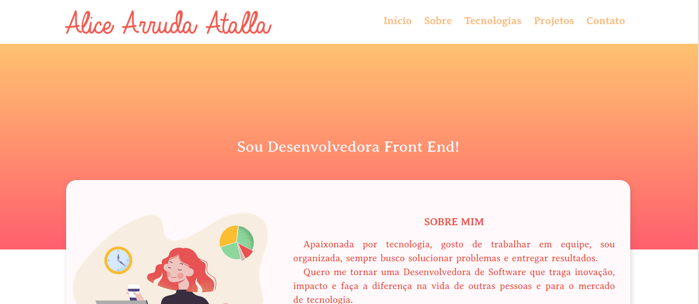

# Portfólio

Meu primeiro portfólio de desenvolvimento web.



#### 🚀 Technologies, libs and frameworks:

- [Javascript](https://www.javascript.com/) \- Programming language;
- [CSS Pure](https://developer.mozilla.org/en-US/docs/Web/CSS) \- Cascading Style Sheets \(CSS\) is a style sheet language;
- [HTML](https://developer.mozilla.org/en-US/docs/Web/HTML) \- HyperText Markup Language is the most basic building block of the Web;
- [NodeJS](https://nodejs.org/en/) \- Node.js is a JavaScript runtime built;
- [Express](https://expressjs.com/) \- Fast, unopinionated, minimalist web framework for Node.js;
- [EJS](https://ejs.co/) \- Embedded JavaScript templating;

---

Status of the Project: Finish :star2:

---

#### 🛠️ Deployment

https://aliceatalla.herokuapp.com/

---

#### 🔧 How to run the application?

At the terminal, clone the project:

```
git clone git@github.com:AliceAAtalla/RecipeApp_ReactJS.git
```

Enter the project folder:

```
cd RecipeApp_ReactJS
```

Install the dependencies:

```
npm install
```

Run the application:

```
npm start
```

There, you can now access the application from the route http://localhost:3000/
